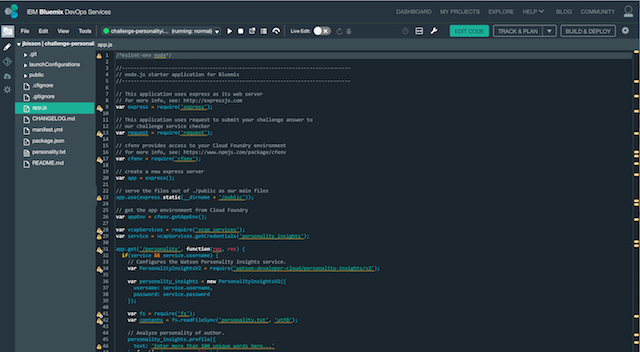

# Code Challenge: Personality Insights

This challenge shows you how to deploy an application on the IBM Bluemix cloud, https://bluemix.net/, use IBM Bluemix DevOps Services, https://hub.jazz.net, and use the IBM Watson Personality Insights service in Node.js. This service is hosted at this URL
https://www.ibm.com/watson/developercloud/personality-insights.html

You can try the service by selecting a person and click on the **analyze button**  to see what personality this person has. For more on the personality models supported see this URL: https://www.ibm.com/watson/developercloud/doc/personality-insights/models.shtml You can also study up on the **API Reference** and **the Documentation.** 

## Running the app on Bluemix

1. We will begin by creating a free account on Bluemix at this URL: https://console.ng.bluemix.net/ 

[](./img/createaccount.png)

1. Deploy the challenge application
We will start by clicking on this link: https://github.com/watson-developer-cloud/personality-insights-nodejs which brings us to the GitHub repository where the code is hosted. We will then scroll down to the **README.md** file, where we will follow the instructions step by step. 

The **Deploy to Bluemix**  button allows us to deploy the GitHub code directly to Bluemix 

 [](https://bluemix.net/deploy?repository=https://github.com/bluemix-code-challenge/challenge-personalityinsights.git)

2. Enter an application name, which must be unique. The host you choose will determinate the subdomain of your application's URL: `<host>.mybluemix.net`.

  [](./img/deploy.png)

3. Wait for the deployment to complete. Click on Edit Code.

  [](./img/deploymentsummary.png)

4. The IBM Bluemix DevOps Services tools allow you to edit code in the browser, configure a pipeline of processes to execute when new code is committed, and deploy applications automatically to IBM Bluemix.

  Select `app.js` to edit the application source code.

  [](./img/devops.png)

5. In this challenge, we’ll analyze the personality of an author based on content they have written.

  [](./img/editor.png)

6. Replace the following code with the contents of the file `personality.txt` (the value of the variable `contents`).

  ```
  ...
  personality_insights.profile({
    text: 'Enter more than 100 unique words here...'
  }, function(err, personality) {
  ...
  ```

  The change should look as shown below.

  ```
  ...
  personality_insights.profile({
    text: contents
  }, function(err, personality) {
  ...
  ```

7. Replace the value for the `email` property on line 53 with your email address. 
  ```
  ...
    // Change only the email address.
    var submission = {
      email: 'you@youremailaddress.com',
      data: JSON.stringify(personality),
  ...
  ```

8. Lastly, uncomment lines 66 – 68 so the application can be verified.

  ```
    // Uncomment
    //request.post('https://code-checker.mybluemix.net/check/challengepersonalityinsights', {form: submission}, function(err, response, body) {
    //  res.send(body);
    //});
  ```

  The change should look as shown below.

  ```
    // Uncomment
    request.post('https://code-checker.mybluemix.net/check/challengepersonalityinsights', {form: submission}, function(err, response, body) {
      res.send(body);
    });
  ```

9. Now that changes have been made, the following steps will commit the changes to the attached Git repo. Click on the Git icon on the left side.

  [](./img/giticon.png)

10. Enter a commit message. Click on Commit.

  [](./img/commit.png)

11. In the left column, click on Push in the Outgoing section. This will push the changes to the remote branch.

  [](./img/push.png)

12. You can see the progress of the application deployment by clicking on the Build & Deploy button in the top-right corner of the page.

  [](./img/pipeline.png)

13. When the application has finished deploying to your IBM Bluemix account, visit your application’s URL, appended with `/personality`.

  [](./img/result.png)

  If you see a Fantastic page, you've completed this challenge successfully. If the page doesn't return a message, or it says Uh Oh!, please check the previous steps.
